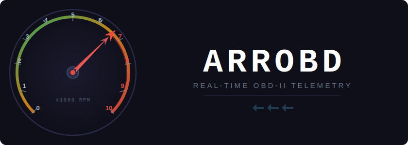

<p align="center">
  
</p>

Real-time OBD-II telemetry built on [Apache Arrow](https://arrow.apache.org/). Reads diagnostic parameters from your vehicle's ECU via an ELM327 adapter, streams columnar Arrow IPC data over WebSocket, and visualizes everything in a live [Perspective](https://perspective.finos.org/) dashboard.

## Building

Requires a C++23 compiler, [Meson](https://mesonbuild.com/), and [Ninja](https://ninja-build.org/).

```bash
meson setup builddir
meson compile -C builddir
```

Dependencies (Apache Arrow and libwebsockets) can be resolved via system packages or will be fetched automatically by Meson wraps.

## Usage

Connect an ELM327 adapter to your vehicle's OBD-II port and plug it into your machine via USB.

```bash
./builddir/arrobd
```

Then open http://localhost:8080 in your browser to view the live dashboard.

### Options

| Flag | Default | Description |
|------|---------|-------------|
| `--device PATH` | `/dev/ttyUSB0` | Serial device path |
| `--baud RATE` | `38400` | Baud rate |
| `--port PORT` | `8080` | WebSocket server port |
| `--poll-ms MS` | `200` | Polling interval in milliseconds |

### Mock mode

To run without hardware (simulated OBD data):

```bash
meson setup builddir -Dmock_mode=true
meson compile -C builddir
./builddir/arrobd
```

## License

Apache License 2.0
